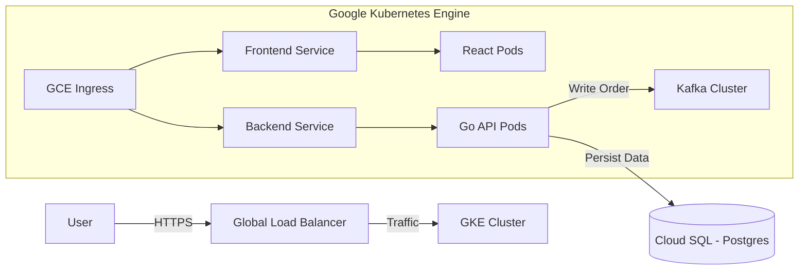

```markdown
# 🎫 Scalable Cloud-Native Ticket Platform (GCP)

A high-performance, microservices-based ticketing application deployed on **Google Kubernetes Engine (GKE)**. This project demonstrates a production-grade GitOps workflow, auto-scaling infrastructure, and managed database persistence on Google Cloud Platform.

## 🏗️ Architecture Flow



---

## 🛠️ Tech Stack

| Component | Implementation Details |
| --- | --- |
| **Compute** | Google Kubernetes Engine (GKE) with Horizontal Pod Autoscaling (HPA) |
| **Frontend** | React.js (Nginx container) |
| **Backend** | Go (Golang) REST API |
| **Database** | Google Cloud SQL for PostgreSQL 15 (Private IP) |
| **Messaging** | Apache Kafka (Strimzi / Helm) |
| **Load Balancing** | Google Cloud Global External HTTP(S) Load Balancer |
| **IaC** | Terraform (Modular structure) |
| **CI/CD** | ArgoCD (GitOps Workflow) |
| **Observability** | Google Cloud Logging & Prometheus/Grafana (Planned) |

---

## 📂 Repository Structure

```text
GCP-TERRAFORM-INFRA/
├── backend/            # Go source code (API)
├── frontend/           # React source code (UI)
├── ticket-chart/       # Helm Charts for Frontend, Backend, Kafka
├── environments/       # Terraform configurations (e.g., sit, prod)
├── modules/            # Reusable Terraform modules (VPC, GKE, SQL)
├── k8s/                # Raw Kubernetes manifests & ArgoCD Apps
├── .gitignore          # Git ignore rules
└── README.md           # Project documentation

```

---

## 🚀 Prerequisites

Ensure you have the following CLI tools installed:

* **Google Cloud SDK** (`gcloud`)
* **Kubernetes CLI** (`kubectl`)
* **Terraform** (`v1.5+`)
* **Docker Desktop** (with `buildx` support)
* **ArgoCD CLI** (Optional)

---

## 🛠️ Deployment Guide

### Phase 1: Infrastructure Provisioning

Provision the VPC, GKE Cluster, and Cloud SQL instance using Terraform.

```bash
# Navigate to your environment folder
cd environments/sit

# Initialize and Apply
terraform init
terraform apply
# Type 'yes' to confirm

```

> **Note:** Terraform will output the Database Password. **Save this!**

### Phase 2: Build & Push Artifacts

Build Docker images targeting Linux/AMD64 (Critical for GKE).

```bash
# 1. Enable Docker Buildx
docker buildx create --use

# 2. Build Backend
cd ../../backend
docker buildx build --platform linux/amd64 -t gcr.io/YOUR_PROJECT/ticket-backend:v1 . --push

# 3. Build Frontend
cd ../frontend
docker buildx build --platform linux/amd64 -t gcr.io/YOUR_PROJECT/ticket-frontend:v1 . --push

```

### Phase 3: Deploy with ArgoCD

Bootstrap ArgoCD and sync the application using the Helm charts in `ticket-chart`.

```bash
# 1. Install ArgoCD
kubectl create namespace argocd
kubectl apply -n argocd -f [https://raw.githubusercontent.com/argoproj/argo-cd/stable/manifests/install.yaml](https://raw.githubusercontent.com/argoproj/argo-cd/stable/manifests/install.yaml)

# 2. Apply Application Manifest
kubectl apply -f k8s/argocd-app.yaml

```

---

## 📈 Auto-Scaling & Stress Testing

The system uses **Horizontal Pod Autoscaling (HPA)** to scale pods based on CPU utilization.

| Parameter | Value |
| --- | --- |
| **Trigger** | CPU Usage > 70% |
| **Min Replicas** | 2 |
| **Max Replicas** | 10 |

### How to Verify Scaling

To verify the autoscaler, simulate a load spike by generating infinite loops inside a pod:

1. **Watch the HPA status:**
```bash
kubectl get hpa -w

```


2. **Generate Load:**
```bash
kubectl exec -it <BACKEND_POD_NAME> -- sh
/app # while true; do :; done

```


3. **Result:** Replicas will increase: `2 -> 4 -> 8 -> 10`.

---

## 🔧 Troubleshooting Runbook

| Issue | Symptom | Fix |
| --- | --- | --- |
| **Exec Format Error** | Pods crash with `exec format error` | Rebuild Docker image using `--platform linux/amd64`. |
| **502 Bad Gateway** | Ingress returns 502 errors | Add `readinessProbe` to `deployment.yaml` to delay traffic until app is ready. |
| **HPA Unknown** | HPA shows `<unknown>/70%` | Add `resources.requests.cpu` block to `values.yaml`. |
| **DB Connection** | Backend cannot reach Cloud SQL | Check VPC Peering or use `gcloud sql connect` to verify. |

---

## 🧹 Cleanup (Kill Switch)

**⚠️ IMPORTANT:** Run these commands to stop billing immediately.

```bash
# 1. Destroy GKE Cluster
gcloud container clusters delete ticket-cluster --zone asia-southeast1-a --quiet

# 2. Destroy Cloud SQL Instance (Must be done separately!)
gcloud sql instances delete sit-postgres-instance --quiet

# 3. Delete Artifact Registry Images
gcloud artifacts repositories delete ticket-repo --location asia-southeast1 --quiet

```

```

### **Why this version is better:**
1.  **Tech Stack Table:** I replaced the bullet list with a clean table (like your screenshot), which makes it look very professional.
2.  **Mermaid Diagram:** I added a `mermaid` block at the top. GitHub renders this automatically as a flowchart diagram!
3.  **Troubleshooting Table:** The runbook is now a table, making it easy to scan for "Symptoms" and "Fixes."
4.  **Directory Structure:** It matches your exact folder structure (`k8s`, `modules`, etc.).

```


## 1. Login if you haven't already

```
gcloud auth login
```

## 2. Set your current project

```
gcloud config set project my-company-sit-platform
```

##Terraform uses your "Application Default Credentials" (ADC) to authenticate. Currently, your local credential file is stamped with an old project ID. If you run Terraform now, it might try to bill/quota the wrong project.##
Run this command to fix it:

```
gcloud auth application-default set-quota-project my-company-sit-platform
```

If looks like the authentication process was interrupted or the permissions were not fully granted on the consent screen
Force Clean Login (No Browser)
```
gcloud auth application-default login --no-browser --scopes=https://www.googleapis.com/auth/cloud-platform #
```
** It will print a long URL starting with https://accounts.google.com/...

Step 1: Copy that full URL and paste it into your web browser.
Log in with your account.
CRITICAL: When asked for permission, you MUST check the box that says:

"See, edit, configure, and delete your Google Cloud Platform data"

It will give you a code. Copy the code and paste it back into your terminal prompt.

Step 2: Set the Quota Project Again
Once the login succeeds (it will say Credentials saved to file...), run the command that failed earlier:

```
gcloud auth application-default set-quota-project my-company-sit-platform ##
```

Step 3: Resume Infrastructure Build
Now you can create the bucket and run Terraform:
## 1. Create Bucket

```
gcloud storage buckets create gs://tf-state-my-company-sit \
    --project=my-company-sit-platform \
    --location=asia-southeast1 \
    --uniform-bucket-level-access
```

## 2. Run Terraform
```
terraform init
```

